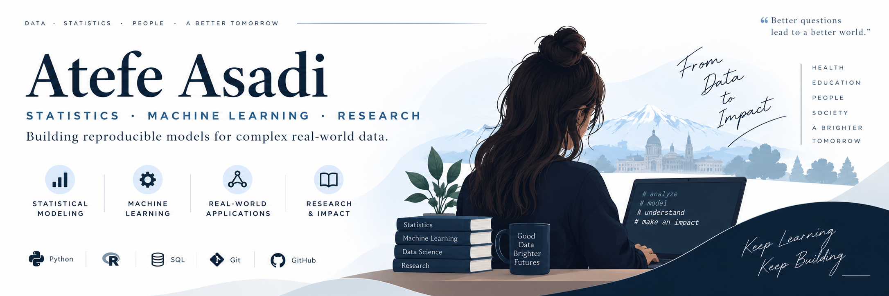

  

## Hi, I'm Atefe 👋

I have an MSc in Statistics and I’m interested in **Data Science, Machine Learning, and research**.

I enjoy working with real-world data, building models, exploring patterns, and learning how statistical methods and machine learning can work together.

---

## About Me

* MSc in Statistics
* Interested in Data Science & Machine Learning
* Working mainly with Python and R
* Interested in health, education, and research data
* Learning and building projects along the way

---

## Selected Projects

### MERF Simulation

My MSc research project, focused on **Mixed Effects Random Forest** and **Mixed Effects Random Tree** for hierarchical data.

`R` `Random Forest` `Mixed Models`

### CV Analyzer

A CV analysis project using R Shiny and local AI models.

`R Shiny` `LLM` `Docker`

### Customer Analytics

Customer behavior analysis using RFM, KPIs, and business metrics.

`Python` `Pandas` `RFM`

---

## Tools I Use

### Programming

`Python` · `R` · `SQL`

### Data & Machine Learning

`Pandas` · `scikit-learn` · `lme4` · `randomForest`

### Analytics & Tools

`Power BI` · `SPSS` · `Git` · `GitHub` 

---

## What I'm Interested In

`Statistics` · `Machine Learning` · `Data Science` · `Mixed Models` · `Health Data` · `Educational Data`

---

## StudyBuild

I’m the founder of **StudyBuild**, a community where we learn data science and research through practical projects.

---

## Connect

[GitHub](https://github.com/AtefeAsadi)

---

  Statistics · Data Science · Machine Learning

  Learning, building, and working with real-world data.

